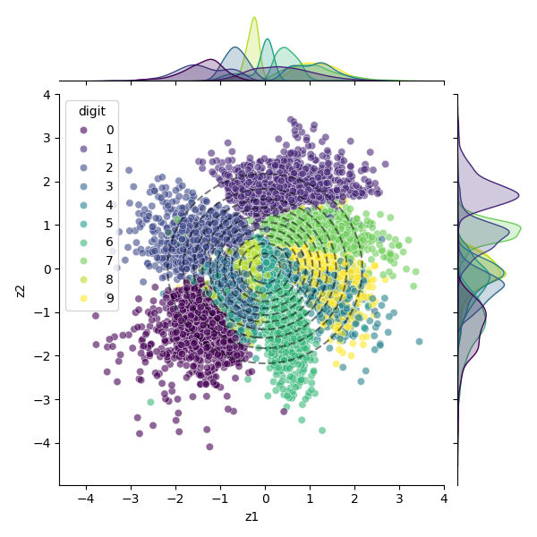
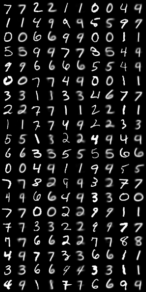
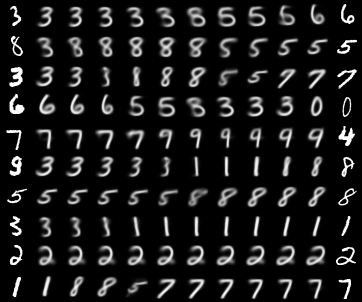
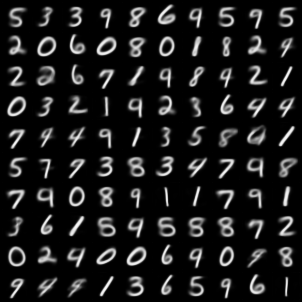
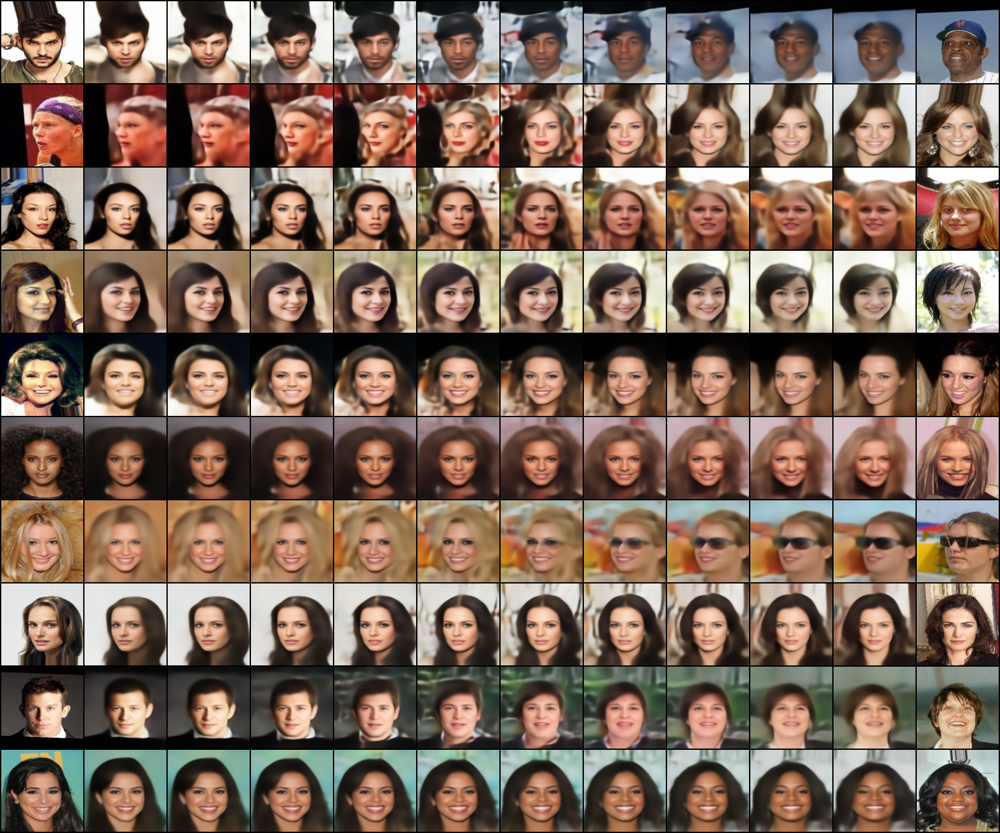
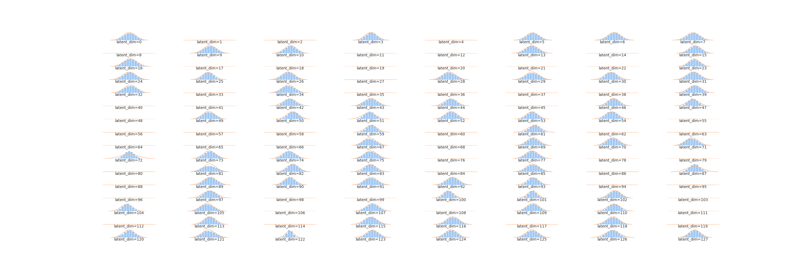

# VAEs

A repository of different implementations of variational autoencoders (VAEs) in PyTorch.

## Architecture

The architecture is inspired by [U-Net](https://arxiv.org/abs/1505.04597), an encoder-decoder architecture. The encoder path consists of `ConvBlock` and `Downsample` modules that progressively reduce the spatial dimensions while increasing feature channels. At the bottleneck, `ResidualBlock` modules refine the encoded features. The decoder path mirrors the encoder, using `ConvBlock` and `Upsample` modules to restore the original spatial dimensions. The network begins with an input projection layer and ends with an output projection layer, ensuring the output matches the input's spatial dimensions.

## Objective

Taken directly from [Autoencoding Variational Bayes](https://arxiv.org/abs/1312.6114).

## Results

### MNIST

| |
|:--:|
| **Figure 1:** **Latent Space**. Each MNIST image is compressed to a two-dimensional latent vector. The plot shows this latent space stratified by the label (digit), computed on the test set. Dashed lines are the contours of 2D unit Gaussian. |

| |
|:--:|
| **Figure 2:** **Reconstructions**. The grid consists of input images and their reconstructions generated by the model. For each pair, the left image is real input, while the right image is the corresponding reconstruction generated by the model.  |

| |
|:--:|
| **Figure 3:** **Interpolations**. The leftmost and rightmost images are interpolation endpoints (inputs), while the middle images are interpolations of these two, generated by the model. |

| |
|:--:|
| **Figure 4:** **Samples**. |

### CelebA

| |
|:--:|
| **Figure 2:** **Reconstructions**. The grid consists of input images and their reconstructions generated by the model. For each pair, the left image is real input, while the right image is the corresponding reconstruction generated by the model. |

| |
|:--:|
| **Figure 3:** **Interpolations**. The leftmost and rightmost images are interpolation endpoints (inputs), while the middle images are interpolations of these two, generated by the model. |

| |
|:--:|
| **Figure 4:** **Samples**. |

| |
|:--:|
| **Figure 5:** **Latent space distribution**. A distribution histogram is computed for each latent space dimension on the test set. The histogram is colored blue, while the probability density function of a unit Gaussian is colored orange. |

## Reproduction

To reproduce these results, download the appropriate checkpoint from `checkpoints` dir and run the notebook.